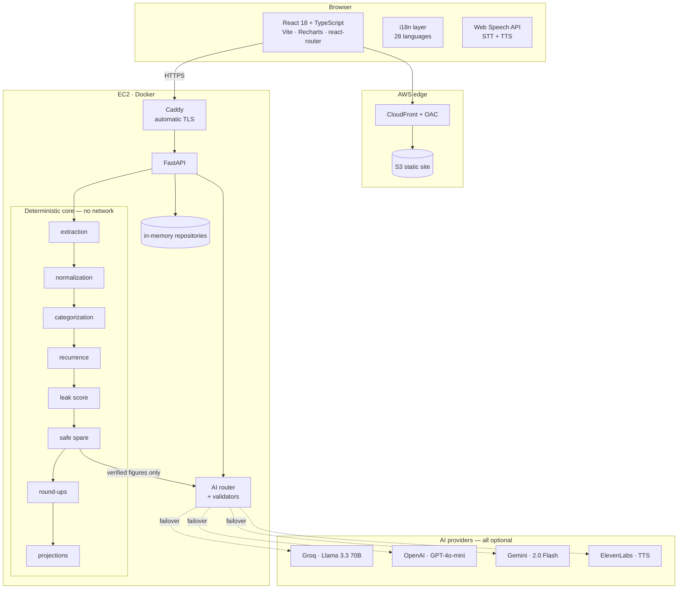

<div align="center">

# 💰 SafeSpare AI

### *"Invest only what life can safely spare."*

**A round-up app that checks whether your rent is due before it invests your spare change.**

<br>

[](https://www.youtube.com/watch?v=wDqa_rXf8d4)
[](SafeSpare_AI_Team_Kryptonite_Final.pdf)
[](https://da2u5q8s30wam.cloudfront.net)
[](https://100-48-40-252.sslip.io/health)
[](#-license)

<br>

[](https://python.org)
[](https://fastapi.tiangolo.com)
[](https://docs.pydantic.dev)
[](https://react.dev)
[](https://typescriptlang.org)
[](https://vitejs.dev)
[](https://recharts.org)
[](https://docker.com)
[](https://terraform.io)
[](https://aws.amazon.com)

[](https://groq.com)
[](https://openai.com)
[](https://ai.google.dev)
[](https://elevenlabs.io)

[](#-testing)
[](#-testing)
[](#-28-languages-curated-first-machine-second)
[](#-the-deterministic-core)
[](#-contributing)

</div>

---

## 📋 Table of contents

- [The one-sentence pitch](#-the-one-sentence-pitch)
- [The problem](#-the-problem)
- [What makes SafeSpare different](#-what-makes-safespare-different)
- [Live demo, video &amp; pitch deck](#-live-demo)
- [Feature tour](#-feature-tour)
- [The Safe Spare engine](#-the-safe-spare-engine)
- [Architecture](#-architecture)
- [The deterministic core](#-the-deterministic-core)
- [AI model routing](#-ai-model-routing)
- [Financial guardrails](#-financial-guardrails)
- [28 languages](#-28-languages-curated-first-machine-second)
- [Voice, in and out](#-voice-in-and-out)
- [API reference](#-api-reference)
- [Tech stack, A to Z](#-tech-stack-a-to-z)
- [Project structure](#-project-structure)
- [Running it locally](#-running-it-locally)
- [Environment variables](#-environment-variables)
- [Deployment](#-deployment)
- [Testing](#-testing)
- [Security & privacy](#-security--privacy)
- [Known limits](#-known-limits)
- [Contributing](#-contributing)

---

## 🎯 The one-sentence pitch

Upload a bank statement; SafeSpare works out how much money you can redirect toward a goal **without
missing a bill**, and refuses to invent a single number it did not calculate from your own
transactions.

**Track:** FinTech — Problem Statement 2, *Smart Expense & Micro-Investment Assistant*.
Recurring-payment and price-leak detection (Problem Statement 1's territory) exists here only to feed
the one metric this product actually ships: how much can safely be spared this month.

---

## 🔥 The problem

> An ordinary round-up app sees a ₹43.20 coffee, rounds it to ₹50.00, and invests the ₹6.80 — with no
> idea that rent is due on Tuesday.

That is not micro-investing. That is an overdraft with extra steps. Spare change *existing* is not
the same as spare change being *safe*, and nothing in a typical round-up flow can tell the
difference.

On the bundled demo statement (195 transactions, 6 months, `demo_data/demo_statement.csv`) the
engine reports **₹7,103.69 safely spare right now**, a **₹6,921.80** safe monthly contribution, and
names the constraint that bound it: *average monthly surplus, not today's balance*. That gap —
between what is available and what is safe — is the entire product.

### It survives contact with a real statement

A genuine HDFC statement broke three separate things, and each fix is in the repository.

**A ₹25,00,000 month, on a ₹23,000 account.** One month carried an outflow 100× its neighbours.
Standard deviation is dominated by exactly the observations that are least representative, so that
single month set a **₹7,12,200 volatility reserve** — more than the account had ever held — and
Safe Spare reported ₹0.00 to a solvent user. `safe_spare._without_outlier_months` trims months
above 4× the median *before* taking stdev. The spend itself is untouched and still counts in every
total: it is real money the user really spent. It just says nothing about how much next month
might vary, and only recurring uncertainty belongs in a reserve.

**Narrations with no spaces in them.** Every category rule was anchored `\b(rent|grocer|…)\b`,
which assumes the bank separates words. HDFC does not: `UPI-MODERNMILKSUPPLIER-Q561721305@YBL`,
`PGACCOMMODATIONMONTHLYRENT`, `UPI-GOOGLECLOUDINDIA`. All 103 debits classified as `unknown`,
essential spending read **₹0.00**, and the whole statement was presented as discretionary.
`categorization.GLUED_RULES` matches against the narration with separators stripped, at a lower
confidence than a word-boundary match, because a substring match is a weaker claim and should not
be sold as a strong one.

**A redemption is not a salary.** A ₹25,00,000 mutual-fund payout fell through to the
credit heuristic and was booked `other_income`. Safe Spare's expected-income term then projected
**₹6,45,890 a month** of income the user could count on before their next paycheck. Fund
redemptions now classify as `investment` — still real income in the totals, never projected forward.

| | before | after |
|---|---:|---:|
| Volatility reserve | ₹7,12,200 | ₹16,129 |
| Essential spending | **₹0.00** | **₹27,750.72** |
| Expected income | ₹6,45,890.51 | ₹20,636.01 |
| Safe Spare now | **₹0.00** | **₹25,451.73** |

The one number that did *not* move is reported total spending: **₹26,20,098**, before and after.
Making an inconvenient figure smaller is not a fix.

---

## ✨ What makes SafeSpare different

<table>
<tr><td width="50%" valign="top">

**🧮 The LLM never does maths**

Every rupee shown anywhere in the product originates in `backend/app/services/`. A model may
*explain* a number. It may never *produce* one. A structural test asserts no service module ever
imports from `app.ai`.

</td><td width="50%" valign="top">

**🔌 Works with zero AI keys**

Pull every API key out and the product still runs end to end. Deterministic templates are the
fallback of last resort, and they are written to be *good*, not to be a placeholder.

</td></tr>
<tr><td width="50%" valign="top">

**🛡️ It will not tell you to cancel your insurance**

Rent, EMI, insurance, medical and tax are structurally protected. No model output can suggest
cancelling one — the refusal is deterministic, never delegated to an LLM.

</td><td width="50%" valign="top">

**🤔 "Unused" requires your confirmation**

A bank statement proves a gym was *charged*. It cannot prove it went unused. SafeSpare will never
call a subscription unused until you say so.

</td></tr>
<tr><td width="50%" valign="top">

**🔍 Every figure is auditable**

Each calculated value carries provenance back to the transactions behind it, and the Safe Spare
snapshot records *which* constraint bound the result. Ask the Coach "why?" and you get the real
reason, from the real snapshot.

</td><td width="50%" valign="top">

**🌏 28 languages, finance terms protected**

Curated translations beat machine translation, always. Amounts, dates and terms like *EMI*, *UPI*
and *Safe Spare* are masked out of translation entirely.

</td></tr>
</table>

---

## 🚀 Live demo

<div align="center">

### 🎬 Watch the demo

[](https://www.youtube.com/watch?v=wDqa_rXf8d4)

**▶ [youtube.com/watch?v=wDqa_rXf8d4](https://www.youtube.com/watch?v=wDqa_rXf8d4)**

*A full walkthrough: statement upload → categorization → Safe Spare → Leak Radar → round-ups → SIP simulation.*

<br>

📑 **[Pitch deck — SafeSpare_AI_Team_Kryptonite_Final.pdf](SafeSpare_AI_Team_Kryptonite_Final.pdf)**
&nbsp;·&nbsp; 7 slides: problem, solution, stack, architecture, conclusion.

</div>

<br>

| | |
|---|---|
| **App** | https://da2u5q8s30wam.cloudfront.net |
| **API** | https://100-48-40-252.sslip.io |
| **Health** | https://100-48-40-252.sslip.io/health |
| **OpenAPI docs** | https://100-48-40-252.sslip.io/docs |

No signup. Upload a CSV / PDF / XLSX statement, or load the bundled synthetic one from the upload
page.

> **Data note:** analyses live in memory only. A container restart wipes every analysis — deliberate
> for a demo handling financial data, and the reason there is no database in the stack.

---

## 🧭 Feature tour

```
UNDERSTAND → PROTECT → RECOVER → ROUND UP → REDIRECT → SIMULATE → GROW
```

| Stage | What happens | Engine | Page |
|---|---|---|---|
| **UNDERSTAND** | Parse, validate, normalize merchants, categorize into 26 categories | `extraction`, `validation`, `merchant_normalization`, `categorization` | `/review`, `/spending` |
| **PROTECT** | Safety buffer + volatility reserve from your own history; essentials untouchable | `safe_spare` | `/safe-spare` |
| **RECOVER** | Recurring payments, silent price hikes, duplicate subscriptions | `recurrence`, `price_changes`, `leak_score` | `/leaks` |
| **ROUND UP** | Historical vs. *allowed* round-ups, capped by Safe Spare and your rules | `roundups` | `/roundups` |
| **REDIRECT** | Confirmed recovered spend raises the monthly contribution | `safe_spare.apply_confirmed_recovery` | `/goals` |
| **SIMULATE** | Mutual-fund SIP illustration under a chosen return scenario; principal and growth kept separate, contribution sourced and capped by Safe Spare | `projections` | `/goals` |
| **GROW** | Illustrative only — no trade is ever executed | `projections.ILLUSTRATIVE_DISCLAIMER` | — |

**Also in the product:** dashboard · cashflow-confidence score (0–100, with its components) · Leak
Radar · voice expense entry · AI Coach with mic and read-aloud · one-button data deletion · live
language switcher.

---

## 🧮 The Safe Spare engine

The heart of the product: `backend/app/services/safe_spare.py`.

```
                    latest verified balance
                  + expected income before next payday
                  − upcoming essential outflows   (rent, EMI, insurance, utilities, tax)
                  − safety buffer                 (max of your minimum and a % of essential spend)
                  − volatility reserve            (from your own outflow variance, outliers trimmed)
                  ────────────────────────────
                  = Safe Spare now                (clamped at zero — never negative)
```

Then the monthly contribution is the **minimum** of Safe Spare now, your average monthly surplus,
and any cap you set — because a healthy balance today does not mean the money is spare; it may just
mean payday was yesterday. The snapshot records which ceiling actually bound, so the product can
always answer *why*:

```json
{
  "safe_spare_now": "7103.69",
  "safe_monthly_contribution": "6921.80",
  "limiting_factor": "monthly_surplus",
  "reason": "Contribution is limited to ₹6921.80 by your average monthly surplus
             rather than by today's balance."
}
```

Every intermediate value is a `Decimal`. No float touches money anywhere in the codebase.

**Confidence is reported, not hidden.** If your statement carries no running balance, the engine
estimates one from cash flow, labels it, adds `running_balance_absent_estimated_from_cashflow` to
`missing_inputs`, and caps confidence at 0.6.

---

## 🏗️ Architecture



### The processing state machine

```
UPLOADED → EXTRACTING → VALIDATING → AWAITING_REVIEW → NORMALIZING → CATEGORIZING
    → DETECTING_RECURRING → CALCULATING_SAFE_SPARE → GENERATING_INSIGHTS → COMPLETED
```

`AWAITING_REVIEW` is a hard stop: nothing is calculated until you confirm the extraction is correct.
`FAILED` is terminal and deliberately outside the ordering, so no code path can "advance" out of it.

---

## ⚙️ The deterministic core

The engine modules under `backend/app/services/` have **no** dependency on any AI provider, and none
on any network call at all. The financial core is importable and testable with the standard library
alone.

| Module | Responsibility |
|---|---|
| `extraction.py` | CSV / PDF (pdfplumber → PyMuPDF fallback) / XLSX / SMS parsing, currency detection |
| `validation.py` | Balance continuity, duplicate detection, date sanity |
| `merchant_normalization.py` | `UPI/AMZ*MKTPLACE/...` → `Amazon`, fuzzy-matched |
| `categorization.py` | 26 categories, merchant dictionary -> word-boundary rules -> glued-narration rules |
| `recurrence.py` | Interval clustering → recurring patterns and real due dates |
| `price_changes.py` | Silent price increases on existing subscriptions |
| `leak_score.py` | Ranks recoverable spend; refuses to touch protected categories |
| `safe_spare.py` | The core calculation above |
| `roundups.py` | Historical vs. allowed round-ups, multiple cap layers |
| `projections.py` | Deterministic future value; principal and growth never merged |
| `cashflow_confidence.py` | 0–100 score with published components |
| `spoken_expenses.py` | Spoken phrasing → amount + category, including Indic digits and lakh/crore |
| `translation.py` | Machine translation with provider failover and term masking |
| `pipeline.py` | Orchestrates the state machine above |

---

## 🤖 AI model routing

Roles are assigned by what each provider is *good* at, and every role has a deterministic fallback.

| Provider | Model | Role | Never does |
|---|---|---|---|
| **Groq** | `llama-3.3-70b-versatile` | Fast explanations, Coach replies, draft cancellation messages | Calculate anything |
| **OpenAI** | `gpt-4o-mini` | Verification of high-impact findings, contradiction detection | Originate a finding |
| **Gemini** | `gemini-2.0-flash` | Multimodal extraction fallback for scanned PDFs, ambiguous merchants | Calculate anything |
| **ElevenLabs** | configurable | Reads aloud a summary the backend already wrote | Generate financial content |
| **Web Speech API** | browser-native | STT + TTS, keyless, zero network | — |

**Role preference order** (`backend/app/ai/router.py`):

```python
ROLE_EXPLANATION  = ("groq", "gemini", "openai")   # speed matters most
ROLE_AMBIGUITY    = ("gemini", "openai", "groq")   # multimodal + reasoning
ROLE_VERIFICATION = ("openai", "gemini", "groq")   # strictness matters most
```

**Failover is real, not decorative.** Each role walks its chain: a rejected credential, a 404 model
id or a timeout costs one wasted request, then the next provider answers. If every provider fails,
the deterministic template answers. The user never sees an error.

> A key being *present* says nothing about it being *accepted*. During development a well-formed
> 164-character OpenAI key returned `401` on every call and took translation down with it — even
> though a working Groq key sat right behind it. Hence the chain.

### How the Coach is kept honest

Every Coach call is built from a prompt containing three fenced blocks:

```
VERIFIED_BACKEND_FACTS   ← every figure the backend calculated, including the
                            Safe Spare breakdown and its limiting factor
EVIDENCE_ROWS            ← the largest individual transactions, redacted and capped
USER_QUESTION            ← untrusted text, neutralized, never placed in a system message
```

The model must answer **only** from those blocks, and must say a figure is unavailable rather than
compute one. The response is then validated against an allowlist built from *the same dictionary
that went into the prompt* — a number may only be stated if the backend put it there. A failed
validation falls back to the deterministic answer.

The Coach's voice is warm and a little funny, with one hard rule encoded in the prompt: never joke
about a shortfall, a debt, a missed bill, or the user being bad with money. Playful about spending
habits, never about the person.

---

## 🛡️ Financial guardrails

Enforced deterministically in code and asserted by `backend/tests/test_guardrails.py`:

| Guardrail | Behaviour |
|---|---|
| **No execution** | No service may grow an `execute_*` / `transfer_funds` / `place_order` method — asserted structurally, so the build fails if one appears |
| **No returns promised** | Any question about guaranteed returns gets a deterministic refusal |
| **No security recommendations** | Never names a stock, fund or cryptocurrency |
| **Protected categories** | Rent, EMI, insurance, medical, tax can never be suggested for cancellation |
| **No unused claims** | A subscription is never described as unused without explicit user confirmation |
| **No account numbers** | Masked at extraction, never stored, never echoed |
| **Prompt injection** | Statement text and questions are data, never instruction; injection attempts are detected and neutralized |
| **Illustrative only** | Every projection carries a disclaimer that outcomes may be higher, lower or negative — shown above *and* below the simulation, because a disclaimer read after the number is read too late |
| **Contribution is derived, never typed** | The monthly SIP is not a form field. It comes from the Safe Spare engine, and `/goals` shows the breakdown — allowed round-ups + confirmed subscription savings + remaining safe headroom — so the cap is visible rather than asserted |
| **Zero stays zero** | When Safe Spare is ₹0 the simulation pauses and says why. It does not synthesise a contribution to make the chart look better |
| **Shortfall extends the date, not the contribution** | When the required monthly exceeds the safe monthly, the advice is a longer horizon — never "invest more" |

---

## 🌍 28 languages, curated first, machine second

Resolution order for every string:

```
1. curated translation shipped in the frontend   ← reviewed wording, always wins
2. local cache (localStorage)                    ← already translated once
3. backend /api/translate                        ← provider chain, key stays server-side
4. English                                       ← always available
```

**Financial vocabulary is never left to a machine.** Before any text is sent to a provider, amounts,
dates, percentages, URLs and every term in `PROTECTED_TERMS` (`Safe Spare`, `UPI`, `EMI`, `NEFT`,
`IMPS`, `RTGS`, `KYC`, `OTP`, …) are replaced with `[[0]]`-style tokens and restored afterwards. A
mistranslated "EMI" would misinform exactly the users this feature exists for.

> The tokens are visible ASCII on purpose. An earlier scheme wrapped the index in private-use code
> points on the theory that nothing would translate them — but models strip characters they cannot
> render, and "Safe Spare" came back as the bare digit `0`. A placeholder only works if the model can
> see it.

---

## 🎙️ Voice, in and out

| Feature | Technology | Why |
|---|---|---|
| **Voice expense entry** | Web Speech API (`SpeechRecognition`) | Keyless, no round trip |
| **Coach mic** | Web Speech API | Ask a question without typing |
| **Read answers aloud** | `speechSynthesis`, rate 0.95 | Slightly slow — a misheard digit is worse than a slow sentence |
| **Voice summary** | ElevenLabs, text fallback | Reads a transcript the backend composed from verified values only |

Speech locale follows the selected UI language. Where a browser lacks the API the control is hidden
rather than shown broken.

The spoken-expense parser is deterministic Python — never an LLM, per the rule above — and handles
Indic digits (२५०, ৫০০, ௧௦௦), Indian numbering (lakh, crore, hazaar) and spoken fractions
(`dhai sau` = 250). It refuses to guess: "I bought something" returns *no amount*, because an
invented number would flow straight into the Safe Spare calculation.

---

## 📡 API reference

Base: `https://100-48-40-252.sslip.io` · session via `X-Session-Id` header or `safespare_session`
cookie · interactive docs at `/docs`.

<details>
<summary><b>Uploads &amp; analysis</b></summary>

| Method | Path | Purpose |
|---|---|---|
| `POST` | `/api/uploads/presign` | Request an upload grant |
| `POST` | `/api/uploads/{id}/content` | Upload the file body |
| `POST` | `/api/analyses` | Start an analysis (202) |
| `GET` | `/api/analyses/{id}/status` | Pipeline state + progress |
| `POST` | `/api/analyses/{id}/confirm` | Confirm the extraction |
| `GET` | `/api/analyses/{id}/summary` | Dashboard summary |
| `GET` | `/api/analyses/{id}/transactions` | Extraction review rows |
| `GET` | `/api/analyses/{id}/categories` | Spending intelligence |
| `GET` | `/api/analyses/{id}/recurring` | Recurring payments |
| `GET` | `/api/analyses/{id}/leaks` | Leak Radar findings |
| `GET` | `/api/analyses/{id}/cashflow-confidence` | Confidence score |

</details>

<details>
<summary><b>Safe Spare, round-ups &amp; goals</b></summary>

| Method | Path | Purpose |
|---|---|---|
| `GET` | `/api/settings/{id}/safe-spare` | Safe Spare breakdown |
| `GET` | `/api/settings/{id}/roundups` | Round-up calculation |
| `POST` | `/api/goals` | Create a goal |
| `PATCH` | `/api/goals/{id}` | Update name, target, date or principal |
| `POST` | `/api/goals/{id}/simulate` | Illustrative projection |
| `POST` | `/api/leaks/{id}/usage-confirmation` | Record a usage answer |
| `POST` | `/api/leaks/{id}/decision` | Keep / cancel / downgrade |
| `POST` | `/api/leaks/{id}/draft-action` | Draft a cancellation message |

</details>

<details>
<summary><b>AI, voice, translation &amp; privacy</b></summary>

| Method | Path | Purpose |
|---|---|---|
| `POST` | `/api/insights/chat` | AI Coach |
| `POST` | `/api/voice/summary` | Spoken summary |
| `POST` | `/api/voice/parse-expense` | Parse a spoken expense (no side effects) |
| `POST` | `/api/voice/confirm-expense` | Store a confirmed spoken expense |
| `POST` | `/api/translate` | Translate UI strings |
| `GET` | `/api/translate/status` | Provider chain + cache stats |
| `POST` | `/api/privacy/delete-data` | Delete everything |
| `GET` | `/health` · `/ready` | Liveness · readiness with provider status |

</details>

> Request schemas set `extra="forbid"`. Send exactly the documented fields — an unexpected one is a
> `422`, not a silent ignore.

---

## 🧰 Tech stack, A to Z

<table>
<tr><th align="left">Layer</th><th align="left">Choice</th><th align="left">Why this one</th></tr>
<tr><td><b>Language (API)</b></td><td>Python 3.11+</td><td><code>Decimal</code> in the standard library; money never touches a float</td></tr>
<tr><td><b>API framework</b></td><td>FastAPI 0.128</td><td>Typed request/response, OpenAPI for free</td></tr>
<tr><td><b>Validation</b></td><td>Pydantic 2.13</td><td>Schema enforcement at the boundary</td></tr>
<tr><td><b>Server</b></td><td>Uvicorn 0.34</td><td>ASGI, standard extras</td></tr>
<tr><td><b>PDF parsing</b></td><td>pdfplumber 0.11 → PyMuPDF 1.26</td><td>Ruled tables first, layout fallback second; both paths tested</td></tr>
<tr><td><b>HTTP client</b></td><td>httpx 0.28</td><td>Providers spoken to as plain REST — no vendor SDK, so a missing key degrades cleanly</td></tr>
<tr><td><b>Frontend</b></td><td>React 18.3 + TypeScript 5.6</td><td><code>strict: true</code>, no <code>any</code> at the API boundary</td></tr>
<tr><td><b>Build</b></td><td>Vite 5.4</td><td>Route-level code splitting; Coach and charts load on demand</td></tr>
<tr><td><b>Routing</b></td><td>react-router-dom 6.26</td><td>—</td></tr>
<tr><td><b>Charts</b></td><td>Recharts 2.12</td><td>—</td></tr>
<tr><td><b>Styling</b></td><td>Hand-written CSS + design tokens</td><td>No framework; tokens in <code>styles/tokens.css</code></td></tr>
<tr><td><b>Speech</b></td><td>Web Speech API</td><td>Keyless, no network, no per-use cost</td></tr>
<tr><td><b>Testing</b></td><td>pytest 8.4</td><td>190 test functions, 292 cases</td></tr>
<tr><td><b>Container</b></td><td>Docker + Compose</td><td>Non-root uid 10001</td></tr>
<tr><td><b>TLS</b></td><td>Caddy</td><td>Automatic Let's Encrypt via sslip.io</td></tr>
<tr><td><b>CDN</b></td><td>CloudFront + OAC</td><td>S3 bucket stays private</td></tr>
<tr><td><b>Secrets</b></td><td>SSM Parameter Store</td><td>SecureString; nothing in the image, nothing in Git</td></tr>
<tr><td><b>IaC</b></td><td>Terraform</td><td>—</td></tr>
<tr><td><b>Deploys</b></td><td>SSM RunShellScript</td><td>No inbound SSH, so there is no key to leak</td></tr>
<tr><td><b>Persistence</b></td><td>In-memory repositories</td><td>Deliberate: financial data outlives no restart</td></tr>
</table>

---

## 📁 Project structure

```
.
├── backend/
│   ├── app/
│   │   ├── api/            # FastAPI routers — thin; no financial logic
│   │   ├── ai/             # provider adapters, router, validators, prompts
│   │   ├── services/       # ⭐ the deterministic financial core
│   │   ├── models/         # entities, enums, state machine
│   │   ├── repositories/   # in-memory persistence
│   │   ├── config.py       # env parsing, including placeholder rejection
│   │   └── main.py
│   ├── tests/              # engines, api, extraction, guardrails, adversarial, …
│   └── requirements.txt
├── frontend/
│   └── src/
│       ├── pages/          # Dashboard, Spending, SafeSpare, RoundUps, LeakRadar,
│       │                   # Goals, Coach, Confidence, Review, Privacy, …
│       ├── components/     # AppShell, Icon, CountUp, VoiceExpense, LanguageSwitcher
│       ├── i18n/           # 28 languages + machine-translation layer
│       ├── hooks/          # useResource, useSpeech
│       ├── api/            # typed client + offline fixtures
│       └── styles/         # tokens, base, app-shell
├── infra/                  # Terraform + deploy / rollback / smoke scripts
├── demo_data/              # synthetic statements
├── scripts/                # generators and utilities
├── ARCHITECTURE.md         # module boundaries, data flow, the real formulas
└── FINANCIAL_GUARDRAILS.md # every guardrail and the test that enforces it
```

---

## 💻 Running it locally

**Prerequisites:** Python 3.11+, Node 18+.

```bash
git clone https://github.com/Hardik182005/InnovaHack-Team-Kryptonite.git
cd InnovaHack-Team-Kryptonite
```

**Backend**

```bash
cd backend
python -m venv .venv && source .venv/bin/activate   # Windows: .venv\Scripts\activate
pip install -r requirements.txt
uvicorn app.main:app --reload --port 8000
```

**Frontend** (second terminal)

```bash
cd frontend
npm install
npm run dev          # http://localhost:5173
```

**Or just use Docker**

```bash
docker compose up --build
```

> **No API keys needed.** With zero keys configured the product runs entirely on the deterministic
> core. Add keys to unlock AI phrasing and machine translation.

---

## 🔑 Environment variables

None are required. Every one is optional and feature-detected at runtime.

| Variable | Default | Purpose |
|---|---|---|
| `GROQ_API_KEY` | — | Explanations, Coach, translation |
| `GROQ_MODEL` | `llama-3.3-70b-versatile` | — |
| `OPENAI_API_KEY` | — | Verification, translation |
| `OPENAI_MODEL` | `gpt-4o-mini` | — |
| `GEMINI_API_KEY` | — | Extraction fallback, ambiguity |
| `GEMINI_MODEL` | `gemini-2.0-flash` | — |
| `GOOGLE_TRANSLATE_API_KEY` | — | Cloud Translation v2; preferred for translation when present |
| `ELEVENLABS_API_KEY` / `_VOICE_ID` / `_MODEL_ID` | — | Voice summary |
| `CORS_ALLOW_ORIGINS` | localhost dev origins | Comma-separated |
| `MAX_UPLOAD_BYTES` | `10485760` | 10 MB |
| `RATE_LIMIT_REQUESTS` / `_WINDOW_SECONDS` | `240` / `60` | Per session |
| `LOG_LEVEL` | `INFO` | — |

Frontend (build-time, inlined by Vite — set **before** `npm run build`):

| Variable | Purpose |
|---|---|
| `VITE_API_BASE_URL` | Backend origin. **Omitting it produces a build that cannot reach the API.** |
| `VITE_DATA_MODE` | `auto` \| `live` \| `fixtures` |
| `VITE_API_TIMEOUT_MS` | Request timeout |

> ⚠️ **Placeholder values are rejected, not honoured.** `OPENAI_MODEL=REPLACE_ME` is *truthy*, so a
> naive `os.environ.get(x) or default` sends `REPLACE_ME` as the model id and 404s on every request.
> `config.py` treats known stub values (`REPLACE_ME`, `CHANGEME`, `TODO`, …) as unset so the default
> actually fires. This one silently took down both the AI Coach and machine translation before it was
> found — hence the guard.

---

## ☁️ Deployment

```
Browser ──► CloudFront (OAC) ──► S3          static frontend
        └─► Caddy (auto-TLS) ──► FastAPI     EC2, Docker Compose
                                    └──► SSM Parameter Store (SecureString)
```

- **Infrastructure:** Terraform under `infra/`
- **Frontend:** `npm run build` → `aws s3 sync dist/ s3://<bucket> --delete` → CloudFront invalidation
- **Backend:** source to S3 → `AWS-RunShellScript` rebuilds the image and recreates the container
- **No inbound SSH.** All administration goes through SSM.
- **Secrets** are pulled from SSM at container start into `/opt/safespare/app.env` (mode 600). None
  are baked into the image; none are in Git.

Helper scripts in `infra/scripts/`: `deploy.sh`, `update.sh`, `rollback.sh`, `smoke-test.sh`,
`seed-demo.sh`, `destroy.sh`.

> ⚠️ Never run a bare `terraform apply` against the live demo: `user_data_replace_on_change = true`
> will destroy and rebuild the EC2 instance.

---

## 🧪 Testing

```bash
cd backend && pytest -q      # 292 passed
cd frontend && npm run typecheck
```

| Suite | Test functions | Covers |
|---|---:|---|
| `test_engines.py` | 44 | The financial core, end to end |
| `test_api.py` | 40 | Every endpoint, session scoping, authorization |
| `test_extraction.py` | 27 | CSV / PDF / XLSX, encodings, malformed input |
| `test_guardrails.py` | 25 | Structural and behavioural safety rules |
| `test_cashflow_confidence.py` | 18 | Score components |
| `test_adversarial.py` | 16 | Hostile statements, injection, tampering |
| `test_spoken_expenses.py` | 15 | Spoken phrasing → structured expense |

Deeper write-ups: [`ARCHITECTURE.md`](ARCHITECTURE.md) for module boundaries, data flow and the real
formulas; [`FINANCIAL_GUARDRAILS.md`](FINANCIAL_GUARDRAILS.md) for every guardrail and the test that
enforces it.

---

## 🔒 Security & privacy

- **Account numbers** are masked at extraction and never stored
- **Nothing persists** — in-memory only; a restart deletes every analysis
- **One-button deletion** — `/api/privacy/delete-data` purges everything for the session
- **Session scoping** — every analysis is bound to a session id and authorized on each request
- **No provider error bodies logged** — only exception *types*, because an error body can echo the
  prompt, which can contain financial detail
- **Statement text is data, never instruction** — injection attempts are detected and neutralized
- **Rate limiting** per session
- **Only synthetic statements** belong in this repository

---

## ⚠️ Known limits

Stated plainly, because a demo that pretends otherwise is worse than one that doesn't:

- **In-memory storage.** Restart the container and all analyses are gone. By design, not an oversight.
- **Single instance.** No horizontal scaling; the session store lives in the process.
- **Illustrative projections only.** No brokerage integration, no trade, no real investment, ever.
- **Machine translation is a fallback.** Curated strings are reviewed; machine-filled gaps are not.
- **PDF extraction is not universal.** Bank layouts vary wildly, and a scanned statement with no text
  layer needs the multimodal path. Unparseable files fail loudly and ask you to review rather than
  guessing.
- **A zero can be the right answer.** If a statement shows spending above income for the period,
  the safe monthly contribution really is ₹0, and SafeSpare says so rather than inventing capacity.
- **Not financial advice.** SafeSpare explains your own numbers. It is not a licensed advisor.

---

## 🤝 Contributing

One rule governs everything: **a model may explain a number, never produce one.** Any financial
value must originate in `backend/app/services/`, and no service module may import from `app.ai`,
make a network call, or accept a parameter that overrides a computed `Decimal`.

`pytest` and `npm run typecheck` must both be clean.

---

## 📄 License

MIT.

---

<div align="center">

**Built for InnovaHack by Team Kryptonite**

*Spare change existing is not the same as spare change being safe.*

</div>
